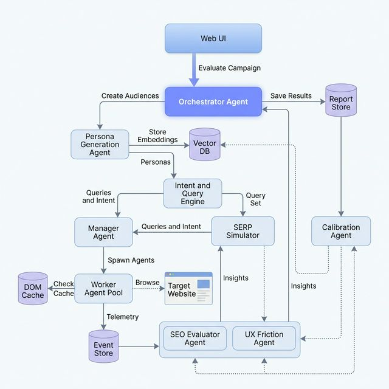

# SAEP — Synthetic Audience Evaluation Platform

Pre-validate landing pages, campaigns, and product pages using AI-generated synthetic audiences — before exposing real users.

SAEP shifts experimentation **left** by deploying LLM-driven behavioral models onto target web properties to detect content gaps, layout friction, and intent mismatches *before* live deployment.

[](https://vercel.com/import/project?template=https://github.com/KrishnaKumarTiwari/synthetic-audience-eval)

**Live Demo:** [prototype-eta-five.vercel.app](https://prototype-eta-five.vercel.app)

---

## Demo

https://github.com/user-attachments/assets/REPLACE_WITH_VIDEO_ID

> **To add:** Record a walkthrough with a screen recorder (e.g. OBS, QuickTime, or Loom), upload it to the GitHub release or drag-drop into a GitHub issue/PR, then paste the resulting URL above.

---

## Architecture



The platform uses an **Agentic Architecture** with specialized, autonomous LLM agents that collaborate to execute the simulation lifecycle:

| Agent | Role |
|---|---|
| **Orchestrator** | Central coordinator — decomposes goals, delegates, synthesizes reports |
| **Persona Generation** | Generates/retrieves high-fidelity synthetic user profiles via Vector DB |
| **Intent & Query Engine** | Produces realistic search queries and intent distributions per persona |
| **SERP Simulator** | Simulates search engine ranking to evaluate query-to-page mapping |
| **Manager** | Fleet management — decides agent count, tier assignment, monitors completion |
| **Worker Agent Pool** | Stateless browser agents that execute actual page browsing (Tier 1–3) |
| **SEO Evaluator** | Computes intent-content cosine similarity, identifies coverage gaps |
| **UX Friction Evaluator** | Uses Decision Perplexity as a proxy for human frustration |
| **Calibration** | Continuously tunes predictions against real analytics (target: Pearson r > 0.85) |

Full design details: [SAEP_HLD.md](./SAEP_HLD.md)

---

## Tech Stack

### Frontend
| Technology | Purpose |
|---|---|
| **Vanilla JavaScript (ES Modules)** | Zero-framework SPA — client-side routing, state management, DOM rendering |
| **HTML5 / CSS3** | Semantic markup with CSS custom properties design system |
| **Inter (Google Fonts)** | UI typography — weights 300–700 |

### Build & Tooling
| Technology | Purpose |
|---|---|
| **Vite 6.1** | Dev server with HMR, production bundler (~147 KB total build) |
| **Custom Vite Plugin** | Dev-time `/api/fetch` proxy middleware for product page scraping |

### Product Scraping (Multi-Strategy)
| Strategy | When Used |
|---|---|
| **`__NEXT_DATA__`** | Next.js e-commerce sites — extracts structured product JSON from SSR payload |
| **JSON-LD (`application/ld+json`)** | Most e-commerce sites — parses `schema.org/Product` structured data |
| **Generic `__NEXT_DATA__`** | Other Next.js sites — walks `pageProps` tree for product-like objects |
| **Open Graph meta tags** | Final fallback — extracts `og:title`, `og:image`, `product:price:amount` |

### Deployment
| Technology | Purpose |
|---|---|
| **Vercel** | Static hosting + serverless functions |
| **Vercel Serverless Function** | `/api/fetch` proxy for production product page scraping |

### LLM Models (Simulation Pipeline)
| Model | Role | Usage Share |
|---|---|---|
| **Claude Sonnet 4.5** | Persona generation, query synthesis, browsing evaluation, scoring | ~68% of calls |
| **Claude Haiku 3.5** | Validation, clustering, classification, formatting | ~26% of calls |
| **text-embedding-3-large** | Query vectors, SERP relevance, content similarity | ~6% of calls |

### Emulation Tiers
| Tier | Cost/Eval | Latency | Capability | Usage |
|---|---|---|---|---|
| **Tier 1 (DOM-only)** | ~$0.002 | < 1s | SEO, content gaps | ~85% |
| **Tier 2 (Full Browser)** | ~$0.15 | 10–30s | Interactive UX flows | ~10% |
| **Tier 3 (Vision-Heavy)** | ~$0.40 | 30–60s | Visual-heavy layouts | ~5% |

---

## Features

- **Campaign Setup** — Enter any product URL, select audience segment, set budget cap, launch simulation
- **Live Product Scraping** — Auto-fetches product metadata (image, title, price, availability) via proxy
- **Synthetic Persona Library** — 100 AI-generated personas across 3 audience segments with filtering and search
- **Simulation Pipeline** — 5-stage animated pipeline (Persona Gen → Query Synthesis → SERP Sim → Agent Browsing → Evaluation)
- **Results Dashboard** — KPIs (score, bounce rate, intent alignment, conversion proxy), SEO coverage, friction analysis, persona breakdown
- **Observability** — LLM call log, token usage, cost breakdown, cache performance, latency metrics
- **Command Palette** — `Cmd+K` quick navigation
- **Keyboard Shortcuts** — `D` Dashboard, `P` Personas, `S` Simulation, `R` Results, `O` Observability
- **Export** — JSON report export with full evaluation data
- **Notifications** — In-app notification center with unread tracking
- **Dark Theme** — Full dark UI with CSS custom properties design system

---

## Project Structure

```
synthetic-audience-eval/
├── SAEP_HLD.md                  # High-Level Design document
├── diagrams/
│   └── saep_architecture.png    # Architecture diagram
└── prototype/
    ├── index.html               # HTML shell — sidebar, header, content area
    ├── app.js                   # Main SPA — routing, views, simulation pipeline
    ├── mock-data.js             # Campaign data, 100 personas, pipeline stages, observability
    ├── product-scraper.js       # Multi-strategy product page parser
    ├── styles.css               # Design system — dark theme, components, layouts
    ├── vite.config.js           # Vite config with /api/fetch proxy plugin
    ├── vercel.json              # Vercel deployment config
    ├── api/
    │   └── fetch.js             # Vercel serverless function — product page proxy
    └── package.json             # Dependencies (vite only)
```

---

## Getting Started

### Prerequisites
- Node.js 18+
- npm

### Local Development

```bash
cd prototype
npm install
npm run dev
```

Open [http://localhost:5173](http://localhost:5173)

### Production Build

```bash
cd prototype
npm run build
npm run preview
```

### Deploy to Vercel

```bash
cd prototype
npx vercel
```

---

## How It Works

1. **Enter a product URL** on the Dashboard — the app scrapes product metadata via the `/api/fetch` proxy
2. **Configure audience** — select a target segment and persona count (100–1000)
3. **Set budget cap** — estimated cost calculated at $0.48/persona
4. **Run Simulation** — the pipeline executes 5 stages with real-time progress, stats, and activity log
5. **View Results** — overall score, SEO query coverage, friction points with recommendations, persona segment breakdown
6. **Check Observability** — every LLM call logged with model, tokens, latency, cost, and cache performance

---

## Design Decisions

| Decision | Rationale |
|---|---|
| **Vanilla JS (no framework)** | Minimal prototype footprint — zero dependencies beyond Vite |
| **Client-side SPA routing** | Simple navigation without URL complexity for a demo |
| **Mock data pipeline** | Demonstrates the full UX flow without requiring live LLM API keys |
| **Multi-strategy scraping** | Maximizes compatibility across e-commerce platforms |
| **Dark theme** | Optimized for long analysis sessions and data-heavy dashboards |
| **CSS custom properties** | Themeable design system without a CSS preprocessor |
| **Vercel serverless proxy** | Bypasses CORS for product page fetching in production |

---

## License

MIT
